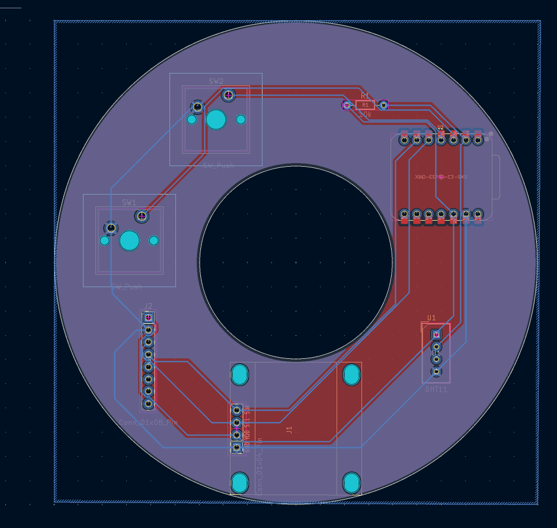
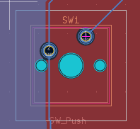
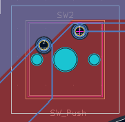

# Half-Life Starbie

A custom motion-controlled digital pet built with the Seeed XIAO ESP32-C3.

## Overview

Half-Life Starbie is a portable digital pet that lives on a small OLED display. The pet can be controlled using buttons and motion input from an MPU6050 accelerometer. The project includes a custom PCB designed in KiCad, Arduino firmware, and fabrication files for manufacturing.

## Features



- XIAO ESP32-C3 microcontroller
- 128x64 OLED display
- MPU6050 accelerometer and gyroscope
- DHT11 temperature and humidity sensor
- Two push buttons
- Motion-controlled radial menu
- Persistent pet statistics
- Custom Half-Life inspired pet sprite
- Sparkle animation effect

## Controls

### Button 1



- Open the radial menu
- Confirm a selected action

### Button 2



- Show or hide the statistics screen

### Tilt Device
- Move the menu selector

### Shake Device
- Interact with the pet

## Hardware

- Seeed XIAO ESP32-C3
- SSD1306 OLED Display
- MPU6050 Module
- DHT11 Sensor
- 2x Push Buttons

## Repository Structure

```text
Firmware/
├── Starbie.ino

KiCad/
├── Starbie.kicad_sch
├── Starbie.kicad_pcb
├── Starbie.kicad_pro

Gerbers/
├── *.*br
├──**.drl
└── *.gbrjob
```

## PCB Render

## How It Works

The pet normally walks around the OLED display. Using the MPU6050, the user can tilt the device to navigate a radial menu and select actions such as:

- NAP - PLAY
- FEED
- PET

Different actions affect the pet's joy, energy and f*llness values. These values are stored in non-volatile memory and remain saved between restarts.

## Firmware

The firmware is written in Arduino C++ and uses the following libraries:

- Adafruit GFX Library
- Adafruit SSD1306
- Adafruit MPU6050
- DHT Sensor Library

## Manufacturing

The repository includes*complete fabrication files:

- Gerber files
- Drill files
- KiCad source files

These files can be uploaded directly to PCB manufacturers such*as JLCPCB or PCBWay.

## Author

Raffael Brauner
````